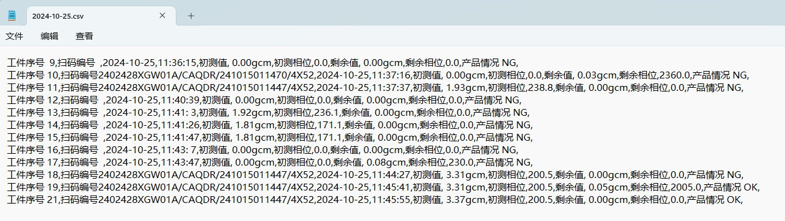
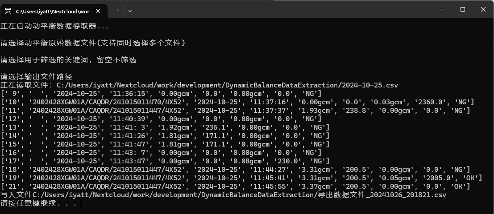
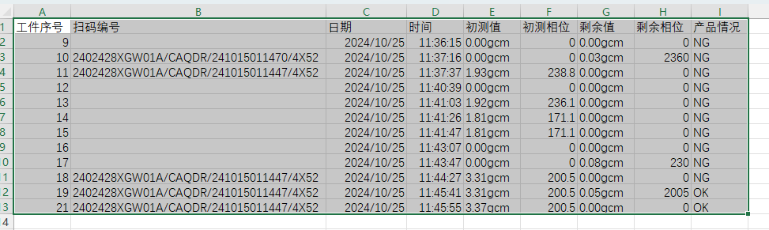

# 动平衡数据提取20241026新程序版

20241026 公司向动平衡设备商（重庆星申）购买的新版程序部署了，新版的程序支持录入序列号，通过扫码枪读取产品二维码获取序列号，将测试的动平衡数据与产品序列号绑定起来。  
在进行动平衡测试后会导出下面格式的 csv 数据  

虽然这个数据可以直接导入 Excel，但是项目名称和项目值会混在一起，所以我立即跟进写了这个数据提取小工具。

## 测试环境

* Windows 11 23H2
* Python 3.12.4