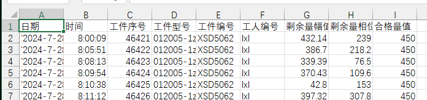

# 动平衡数据提取 v0.0.1

公司的动平衡机在进行测试后会保存相关的数据在文本文件中，且所有产品的数据会存放在一个文件里，数据值和文字描述也混合在一起，如下图：  

这种格式的数据用 Excel 其实也能处理出来，但是每次去筛选提取就有点麻烦，因此我就写了一个小工具来处理。  
提取处理会把文字描述和对应的值分离出来，行数据不同字段之间以半角逗号分隔并保存为文本文件（CSV格式），方便 EXCEL 导入处理数据。

## 测试环境

* Windows 11 23H2
* Python 3.12.4